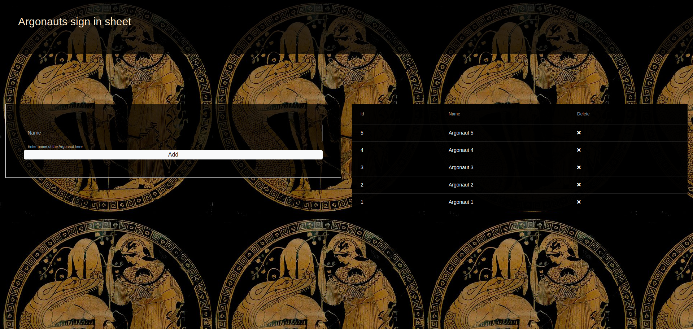
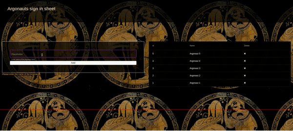

<h1>Argonauts</h1>

CRUD to add and delete Argonauts

Entery project for Dev Alternance @ WCS Lyon

To set up the project cd front and run command: <strong>ng serve -o</strong> and cd server and run command <strong> npm start</strong> 

<h3>Screenshot of the project</h3>

<h3>Short demo of the project</h3>

Video demo of the project can be found in assets folder

